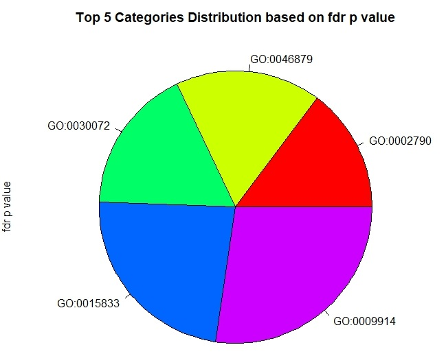
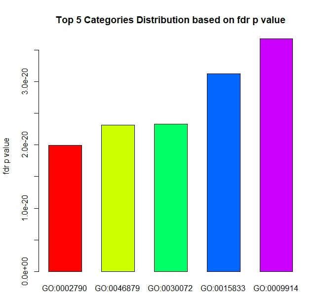
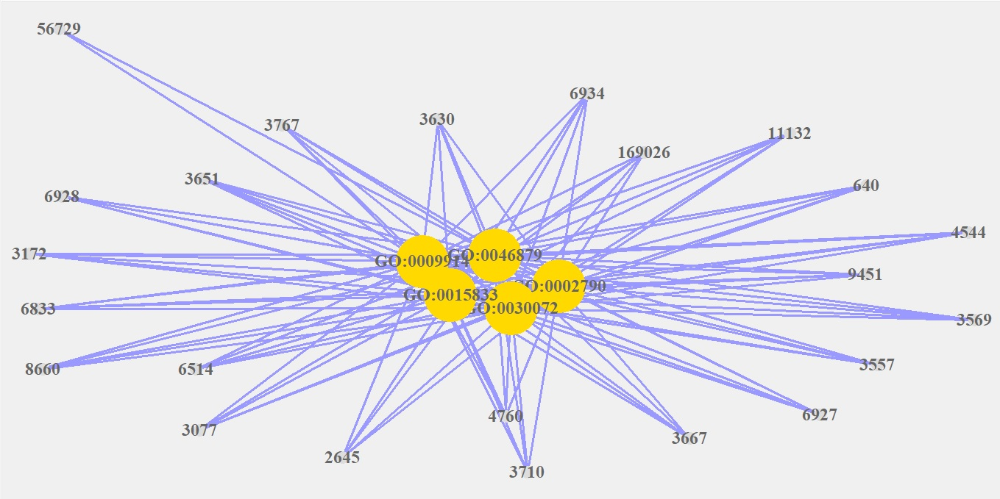
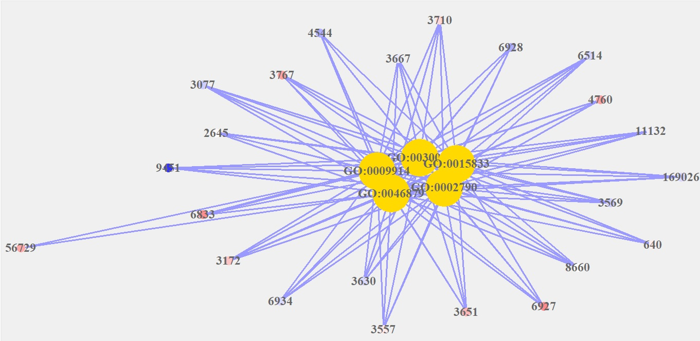
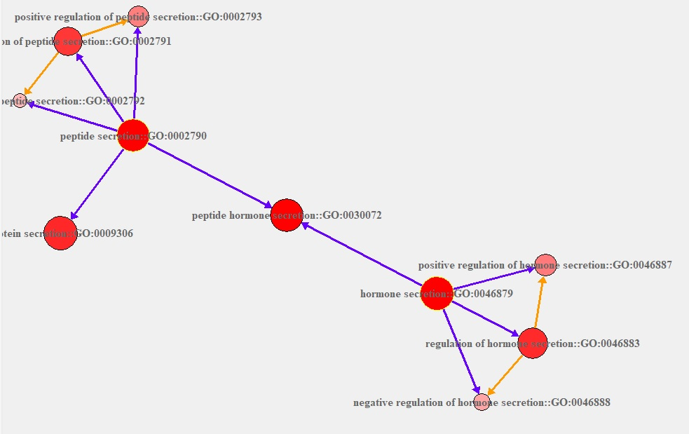
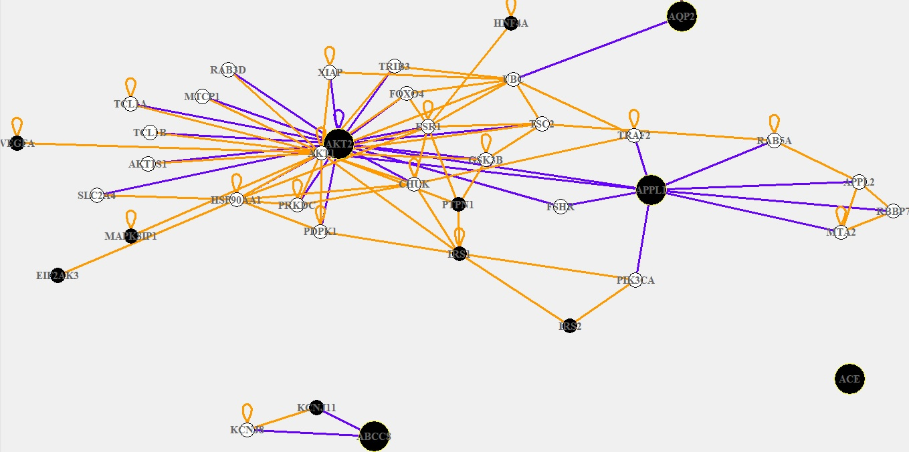
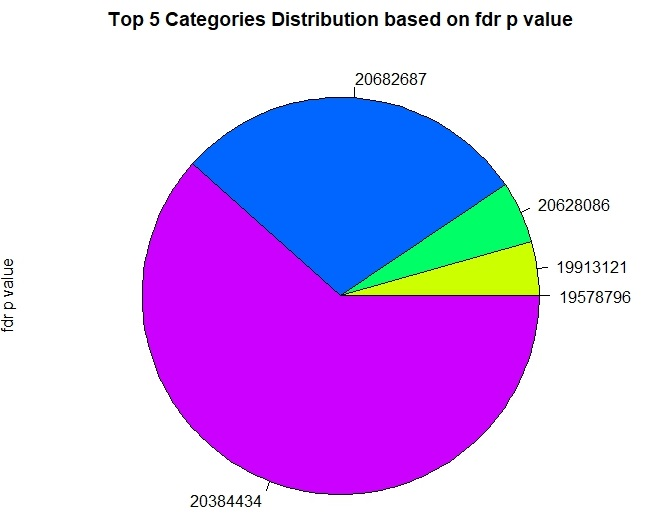
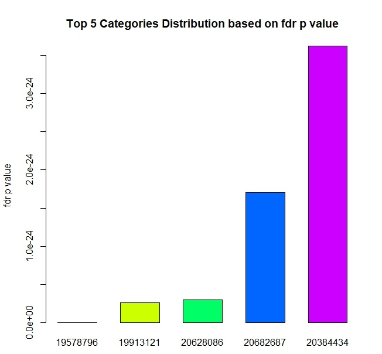
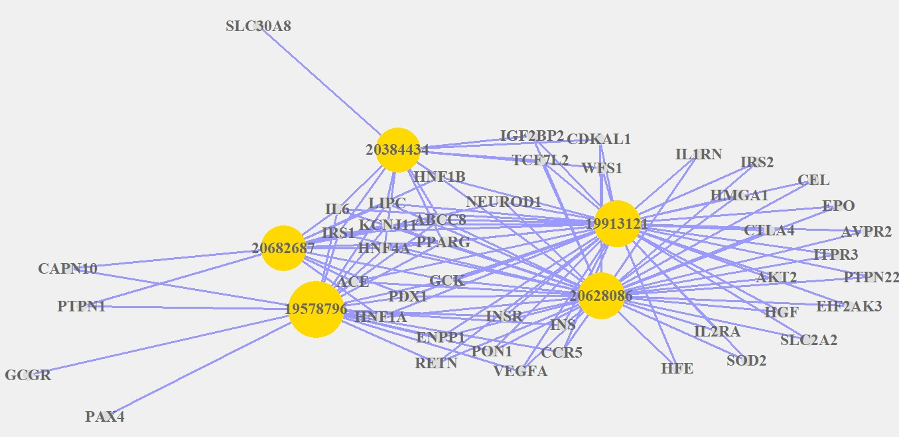
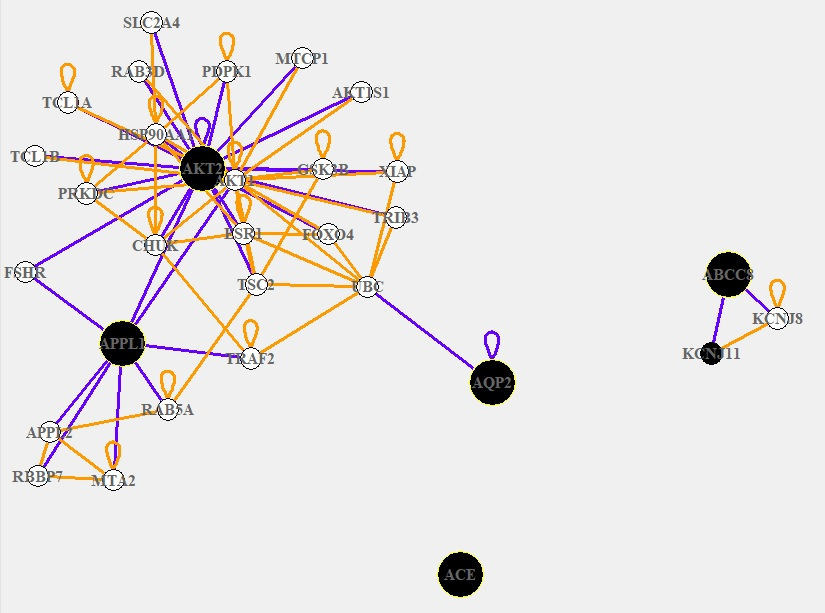

```{r setup, include=FALSE}
knitr::opts_chunk$set(echo = TRUE)
```

# Introduction

InterMine constitutes a powerful open source data warehouse system which integrates diverse biological data sets and provides a growing number of analysis tools, including enrichment analysis widgets [@Smith2012;@Kalderimis2014].

Specifically, the gene set enrichment tool looks for annotations to a set of genes that occur more than would be expected by chance, given a background population of annotations. The hypergeometric distribution is used to calculate a P-value for each annotation and a choice of correction methods for multiple testing (Bonferonni, Holm-Bonferonni and Benjamini Hochberg) are available [@Smith2012;@Kalderimis2014]. 

InterMine provides Gene Ontology enrichment statistics as well as enrichment statistics for other annotation types including protein domains, pathways, human diseases, mammalian phenotypes and publications. The default background population is all genes in the genome with the specified annotation type. However, the background population can be changed by specifying another list. More information can be found in the online [documentation](http://intermine.readthedocs.io/en/latest/embedding/list-widgets/enrichment-widgets/).

# Perform enrichment analysis with InterMineR

Performing enrichment analysis with InterMineR is preceded by two steps:

1. Retrieve the list of bioentities of interest (Genes, Proteins, SNPs, etc.) for which the analysis will be performed.

2. Get the enrichment widget name which indicates the annotation types that you want to investigate for enrichment (e.g. Gene Ontology Terms, protein domains, KEGG and Reactome Pathways, human diseases, mammalian phenotypes and publications).

## Retrieve list containing the genes of interest from InterMineR

In this example, enrichment analysis is performed using a list of genes which are associated with all forms of Diabetes according to OMIM. 

The PL_DiabetesGenes dataset is included in the InterMineR package and can also be found online in [HumanMine](http://www.humanmine.org/humanmine/bag.do?subtab=view).

```{r load_InterMineR, message=FALSE, warning=FALSE}
library(InterMineR)
```

Retrieve PL_DiabetesGenes data and get gene identifiers as HumanrMine Gene.symbol and Gene.primaryIdentifier values (ENTREZ IDs).

```{r source_function_load_data, message=FALSE, warning=FALSE}
# get HumanMine instance
im.human = initInterMine(listMines()["HumanMine"])

# retrieve data model for HumanMine
hsa_model = getModel(im.human)

# all targets of HumanMine enrichment widgets possess InterMine ids
subset(hsa_model, type %in% c("Gene", "Protein", "SNP") & child_name == "id")

# load human genes which are associated with Diabetes (retrieved from HumanMine)
data("PL_DiabetesGenes")

head(PL_DiabetesGenes, 3)

# get Gene.symbol
hsa_gene_names = as.character(PL_DiabetesGenes$Gene.symbol)

head(hsa_gene_names, 3)

# get Gene.primaryIdentifiers (ENTREZ Gene identifiers) 
hsa_gene_entrez = as.character(PL_DiabetesGenes$Gene.primaryIdentifier)

head(hsa_gene_entrez, 3)
```

## Get enrichment widgets

After obtaining the Gene.id values of interest, we must determine the type of annotation for the enrichment analysis.

To retrieve all available widgets for a Mine we can use the `getWidgets` function.

```{r doEnrichment, message=FALSE, warning=FALSE}
# get all HumanMine widgets
human.widgets = as.data.frame(getWidgets(im.human))

human.widgets
```

HumanMine provides enrichment for genes, proteins and SNPs, but here we are interested only in the gene-related, enrichment widgets.

```{r enrichment_widgets_gene_targets, message=FALSE, warning=FALSE}
# get enrichment, gene-related widgets for HumanMine
subset(human.widgets, widgetType == 'enrichment' & targets == "Gene")
```

The column **names** provides the character strings that can be passed as arguments to the `doEnrichment` function and thus define the type of enrichment analysis.

## Perform enrichment analysis with InterMineR

We will perform Gene Ontology Enrichment analysis for the genes in our list using the Gene.id values and the 'go_enrichment_for_gene' widget.

```{r go_enrichment_analysis, message=FALSE, warning=FALSE}
# Assign directly the doEnrichment.string from getGeneIds function to the ids argument of doEnrichment to perform the analysis

# Perform enrichment analysis
GO_enrichResult = doEnrichment(
  im = im.human,
  ids = hsa_gene_entrez,
  widget = "go_enrichment_for_gene"
  # organism = "Homo sapiens" # optional if results from more than one organism are retrieved
)
```

As mentioned above 'PL_DiabetesGenes' constitutes a genelist which already exists in HumanMine. Therefore, the enrichment analysis could also be performed by passing the name of the list to the genelist argument, with the same results:

```{r doEnrichment_genelist, message=FALSE, warning=FALSE, eval=FALSE}
# Perform enrichment analysis with genelist name instead of ids
GO_enrichResult = doEnrichment(
  im = im.human,
  genelist = "PL_DiabetesGenes",
  # ids = hsa_gene_entrez,
  widget = "go_enrichment_for_gene"
)
```

`doEnrichment` function returns a list which contains:

* a data.frame with the results of the enrichment analysis which was performed in the defined InterMine platform. p-values are given after applying the correction algorithm. Count and populationAnnotationCount columns contain the number of genes that belong to each GO term in the list and in the background population respectively.

```{r data_frame_enrichResult, message=FALSE, warning=FALSE}
# data.frame containing the results of the enrichment analysis
head(GO_enrichResult$data)

dim(GO_enrichResult$data)
```

* the size of the reference background population (populationCount)

```{r populationCount, message=FALSE, warning=FALSE}
GO_enrichResult$populationCount
```

* the number of input features that were not included in the enrichment analysis (notAnalyzed)

```{r notAnalysed, message=FALSE, warning=FALSE}
GO_enrichResult$notAnalysed
```

* the name and url of the Mine (im)

```{r im, message=FALSE, warning=FALSE}
GO_enrichResult$im
```

* the rest of the parameters used to perform the analysis (parameters)

```{r parameters, message=FALSE, warning=FALSE}
GO_enrichResult$parameters
```

## Apply filters on enrichment analysis

Some of the enrichment widgets contain filters which, when applied, limit the annotation types of the enrichment analysis.

In our example, if we want to retrieve only the enriched GO terms in our list of genes that are related to molecular function, we will use the appropriate filter:

```{r go_filter, message=FALSE, warning=FALSE}
# get available filter values for Gene Ontology Enrichment widget
as.character(subset(human.widgets, name == "go_enrichment_for_gene")$filters)

# Perform enrichment analysis for GO molecular function terms
GO_MF_enrichResult = doEnrichment(
  im = im.human,
  ids = hsa_gene_entrez,
  widget = "go_enrichment_for_gene",
  filter = "molecular_function")

head(GO_MF_enrichResult$data)

dim(GO_MF_enrichResult$data)
```

## Apply multiple test correction

To reduce the probability of false positive errors, three different multiple correction algorithms can be applied to the results of the enrichment analysis:

* Benjamini Hochberg (default)
* Holm-Bonferroni
* Bonferroni

The application of one of these algorithms changes the p-values and determines the number of the results which will be returned from the analysis:

```{r prot_domain_changing_correction, message=FALSE, warning=FALSE}
# Perform enrichment analysis for Protein Domains in list of genes
PD_FDR_enrichResult = doEnrichment(
  im = im.human,
  ids = hsa_gene_entrez,
  widget = "prot_dom_enrichment_for_gene",
  correction = "Benjamini Hochberg"
) 

head(PD_FDR_enrichResult$data)

# Perform enrichment analysis for Protein Domains in list of genes
# but without a correction algoritm this time
PD_None_enrichResult = doEnrichment(
  im = im.human,
  ids = hsa_gene_entrez,
  widget = "prot_dom_enrichment_for_gene",
  correction = "None"
)

head(PD_None_enrichResult$data)
```

# Visualization of InterMineR Gene Ontology Enrichment analysis results

## Convert InterMineR enrichment analysis results to a GeneAnswer-class object

In order to visualize the InterMineR enrichment analysis results, we will use the function `convertToGeneAnswers`. This function was created to facilitate the visualization of `doEnrichment` function results by converting them into a `GeneAnswers-class` object. 

This way we can utilize the functions of the package GeneAnswers to visualize the results of the enrichment analysis and the relations between the features (e.g. genes) and/or the annoatation categories (e.g. GO terms) [@Feng2010;@Feng2012;@Huang2014].

```{r convertToGeneAnswers, message=FALSE, warning=FALSE}
# load GeneAnswers package
library(GeneAnswers)

# convert InterMineR Gene Ontology Enrichment analysis results to GeneAnswers object
geneanswer_object = convertToGeneAnswers(
  
  # assign with doEnrichment result:
  enrichmentResult = GO_enrichResult,
  
  # assign with list of genes:
  geneInput = data.frame(GeneID = as.character(hsa_gene_entrez), 
                         stringsAsFactors = FALSE),
  
  # assign with the type of gene identifier
  # in our example we use Gene.primaryIdentifier values (ENTREZ IDs):
  geneInputType = "Gene.primaryIdentifier",
  
  # assign with Bioconductor annotation package:
  annLib = 'org.Hs.eg.db',
  
  # assign with annotation category type
  # in our example we use Gene Ontology (GO) terms:
  categoryType = "GO"
  
  #optional define manually if 'enrichIdentifier' is missing from getWidgets:
  #enrichCategoryChildName = "Gene.goAnnotation.ontologyTerm.parents.identifier"
)

class(geneanswer_object)
summary(geneanswer_object)
#slotNames(geneanswer_object)
```

GeneAnswers is package designed for the enrichment analysis and visualization of gene lists. It is worth mentioning that the InterMineR filters for the widgets of Gene Ontology and Pathway Enrichment:

```{r filters_GO_&_pathways, message=FALSE, warning=FALSE}
as.character(
subset(human.widgets,
       title %in% c("Gene Ontology Enrichment",
                    "Pathway Enrichment"))$filters
)
```

match the following available values:

InterMineR widget name | InterMineR filter | `convertToGeneAnswers` categoryType |
-----------------------|-------------------|-------------------------------------|
go_enrichment_for_gene | biological_process | GO.BP |
go_enrichment_for_gene | cellular_component | GO.CC |
go_enrichment_for_gene | molecular_function | GO.MF |
pathway_enrichment | KEGG pathways data set | KEGG |
pathway_enrichment | Reactome data set | REACTOME.PATH |

for the categoryType argument of the `geneAnswerBuilder` function, and can be assigned accordingly in the categoryType argument of the `convertToGeneAnswers`, therby facilitating the conversion of InterMineR Gene Ontology and Pathway Enrichment analysis results to `GeneAnswers-class` objects.

```{r GO_terms_MF, message=FALSE, warning=FALSE}
# convert to GeneAnswers results for GO terms associated with molecular function
geneanswer_MF_object = convertToGeneAnswers(
  enrichmentResult = GO_MF_enrichResult,
  geneInput = data.frame(GeneID = as.character(hsa_gene_entrez), 
                         stringsAsFactors = FALSE),
  geneInputType = "Gene.primaryIdentifier",
  annLib = 'org.Hs.eg.db',
  categoryType = "GO.MF"
  #enrichCategoryChildName = "Gene.goAnnotation.ontologyTerm.parents.identifier"
)

class(geneanswer_MF_object)
summary(geneanswer_MF_object)
#slotNames(geneanswer_MF_object)
```

Briefly, in the following sections we present how to use several functions of the GeneAnswers package to visualize the results of the Gene Ontology Enrichment analysis on the `PL_DiabetesGenes` gene list.

For more information about the usage of GeneAnswers package, the user should look at the respective [documentation](https://www.bioconductor.org/packages/release/bioc/html/GeneAnswers.html).

## PieChart and BarPlot graphs

```{r geneanswer_readable, message=FALSE, warning=FALSE, eval = FALSE }
# Make GeneAnswers Instance readable
geneanswer_object_readable = geneAnswersReadable(geneanswer_object)
```

```{r piechart, message=FALSE, warning=FALSE, eval = FALSE}
# GeneAnswers pieChart
geneAnswersChartPlots(geneanswer_object_readable, 
                      chartType='pieChart',
                      sortBy = 'correctedPvalue',
                      top = 3)
```


<p style="text-align: center;">**Figure 1**: Pie chart of the top three GO terms with the smallest FDR-corrected p-values.</p>

```{r barplot, message=FALSE, warning=FALSE, eval = FALSE}
# GeneAnswers barplot
geneAnswersChartPlots(geneanswer_object_readable, 
                      chartType='barPlot',
                      sortBy = 'correctedPvalue',
                      top = 5)
```


<p style="text-align: center;">**Figure 2**: Bar plot of the top five GO terms with the smallest FDR-corrected p-values.</p>

## Concept-gene network

```{r geneAnswersConceptNet, message=FALSE, warning=FALSE, eval = FALSE}
# generate concept-gene network
geneAnswersConceptNet(geneanswer_object, 
                      colorValueColumn=NULL,
                      centroidSize='correctedPvalue', 
                      output='interactive',
                      geneSymbol = TRUE,
                      catTerm = TRUE,
                      catID = TRUE,
                      showCats = 1:5)
```



<p style="text-align: center;">**Figure 3**: Screen shot of concept-gene network for the first five GO terms. The size of nodes is proportional to
the number of genes in each GO term.</p>

The color of gene nodes can be changed based on the numeric values associated with the genes.

```{r pseudo_foldChange, message=FALSE, warning=FALSE, eval = FALSE}
# generate concept-gene network
# for visualization purposes add a column of RANDOM numbers in geneInput
set.seed(123)
geneanswer_object@geneInput$random_values = rnorm(nrow(geneanswer_object@geneInput))

geneAnswersConceptNet(geneanswer_object, 
                      colorValueColumn=2,
                      centroidSize='correctedPvalue', 
                      output='interactive',
                      geneSymbol = TRUE,
                      catTerm = TRUE,
                      catID = TRUE,
                      showCats = 1:5)
```



<p style="text-align: center;">**Figure 4**: Screen shot of concept-gene network for the first five GO terms. Random numeric values have been assigned as column to geneInput in order to visualize the ability to add color to gene nodes. The size of nodes is proportional to
the number of genes in each GO term.</p>

## Gene Ontology structure network

```{r geneAnswersConceptRelation, message=FALSE, warning=FALSE, eval = FALSE}
# visualize the relations between the first two GO terms
geneAnswersConceptRelation(geneanswer_object,
                           directed=TRUE, 
                           netMode='connection',
                           catTerm=TRUE, 
                           catID=TRUE,
                           showCats = 1:2)
```



<p style="text-align: center;">**Figure 5**: Screen shot of Gene Ontology structure network for the first two GO terms. The size of nodes is proportional to number of genes in these GO terms. The color of nodes stand for how
relative the given genes are to the GO terms. More red, more relative. The
given GO terms are yellow framed dots with dark purple edges as connections.</p>

## Gene interaction network

The functions of GeneAnswers package make use of several [Bioconductor Annotation Packages](http://www.bioconductor.org/packages/release/data/annotation/), which are primarily based on Entrez Gene identifiers.

In our example, GeneAnswers uses the annotation package 'org.Hs.eg.db', which was specified previously in `convertToGeneAnswers` function, to retrieve gene interactions for the specified genes.

```{r buildNet, message=FALSE, warning=FALSE, eval = FALSE}
# visualize interactions between the first five genes
buildNet(getGeneInput(geneanswer_object)[1:5,1],
         idType='GeneInteraction', 
         layers=2,
         filterGraphIDs=getGeneInput(geneanswer_object)[,1],
         filterLayer=2, 
         netMode='connection')
```



<p style="text-align: center;">**Figure 6**: Screen shot of gene interaction network for the first five genes of PL_DiabetesGenes. The large black dots with yellow frame stand for the five given genes. They also connect to other genes by dark-blue-purple edges. Small black dots represent the other genes from `getGeneInput`. Small white dots are genes that are not in the genes from `getGeneInput`, but interact with these genes.</p>

## Gene Ontology terms - Genes cross tabulation
 
```{r geneAnswersHeatmap, message=FALSE, warning=FALSE, eval = TRUE}
# generate GO terms - Genes cross tabulation
geneAnswersHeatmap(geneanswer_object, 
                   catTerm=TRUE, 
                   geneSymbol=TRUE,
                   showCats = 5:10,
                   cex.axis = 0.75)
```

# Visualization of InterMineR Publication Enrichment analysis results

## Perform Publication Enrichment analysis

Although GeneAnswers package is designed for performing enrichment analysis on genes and reporting enriched pathways, it is possible to utilize some of its functions to visualize the results of the various enrichment widgets used by InterMineR.

Specifically in the current example we will show how to perform visualizations on publication enrichment analysis results.

```{r publication_enrichment, message=FALSE, warning=FALSE}
# publication enrichment analysis
publication_enrichResult = doEnrichment(
  im = im.human,
  ids = hsa_gene_entrez,
  widget = "publication_enrichment")
```

Since we are performing conversion of enrichment results that are not related to pathways there are three things to notice here:

* We are deliberately assign Gene.symbol instead of Gene.primaryIdentifier values as **geneInput**. This will result in a more readable concept-gene network and can be changed in order to generate the gene interaction network.
* **annLib** argument is assigned with 'org.Hs.eg.db' as before
* **categoryType** is assigned with NULL since we no longer use GO terms but PubMed IDs (Gene.publications.pubMedId) as annotation categories.

```{r publication_conversion, message=FALSE, warning=FALSE}
# convert to GeneAnswer-class
# use Gene.symbol values instead of Gene.primaryIdentifier (ENTREZ)
geneanswer_pubs_object = convertToGeneAnswers(
  enrichmentResult = publication_enrichResult,
  geneInput = data.frame(GeneID = as.character(hsa_gene_names),
                         stringsAsFactors = FALSE),
  geneInputType = "Gene.symbol",
  annLib = 'org.Hs.eg.db',
  categoryType = NULL,
  enrichCategoryChildName = "Gene.publications.pubMedId"
)

class(geneanswer_pubs_object)
summary(geneanswer_pubs_object)
#slotNames(geneanswer_pubs_object)
```

## PieChart and BarPlot graphs

```{r pub_piechart, message=FALSE, warning=FALSE, eval=FALSE}
# GeneAnswers pieChart
geneAnswersChartPlots(geneanswer_pubs_object, 
                      chartType='pieChart',
                      sortBy = 'correctedPvalue',
                      top = 5)
```


<p style="text-align: center;">**Figure 7**: Pie chart of the top five PubMed IDs with the smallest FDR-corrected p-values.</p>

```{r pub_barplot, message=FALSE, warning=FALSE, eval=FALSE}
# GeneAnswers barplot
geneAnswersChartPlots(geneanswer_pubs_object, 
                      chartType='barPlot',
                      sortBy = 'correctedPvalue',
                      top = 5)
```


<p style="text-align: center;">**Figure 8**: Bar plot of the top five PubMed IDs with the smallest FDR-corrected p-values.</p>

## Concept-gene network

It is important to note that the arguments **catTerm** and **catID** are assigned with **FALSE**. This is because the function is not expecting PubMed IDs as annotation categories and it will fail to convert them to short descriptions (as it would do with GO terms or KEGG and REACTOME pathways).

```{r pub_concept_gene_network, message=FALSE, warning=FALSE, eval=FALSE}
# generate concept-gene network
geneAnswersConceptNet(geneanswer_pubs_object, 
                      colorValueColumn=NULL,
                      centroidSize='correctedPvalue', 
                      output='interactive',
                      catTerm = FALSE,
                      catID = FALSE,
                      showCats = 1:5)
```



<p style="text-align: center;">**Figure 9**: Screen shot of concept-gene network for the first five PubMed IDs. The size of nodes is proportional to
the number of genes in each PubMed ID.</p>

## Gene interaction network

To generate a gene interaction network it is necessary to replace Gene.symbol with Gene.primaryIdentifier values because `buildNet` function retrieves gene interactions from the 'org.Hs.eg.db' package, which uses ENTREZ identifiers for mapping.

```{r pub_gene_interaction, message=FALSE, warning=FALSE, eval=FALSE}
# copy the existing GeneAnswer-class object
geneanswer_pubs_object2 = geneanswer_pubs_object

# replace Gene.symbol with Gene.primaryIdentifier values
geneanswer_pubs_object2@geneInput = data.frame(
  GeneID = as.character(hsa_gene_entrez), 
  stringsAsFactors = FALSE)

# generate gene interaction network
buildNet(getGeneInput(geneanswer_pubs_object2)[1:5,1],
         idType='GeneInteraction', 
         layers=2,
         filterGraphIDs=getGeneInput(geneanswer_pubs_object)[,1],
         filterLayer=2, 
         netMode='connection')
```



<p style="text-align: center;">**Figure 10**: Screen shot of gene interaction network for the first five genes of PL_DiabetesGenes. The large black dots with yellow frame stand for the five given genes. They also connect to other genes by dark-blue-purple edges. Small black dots represent the other genes from `getGeneInput`. Small white dots are genes that are not in the genes from `getGeneInput`, but interact with these genes.</p>

# System info

```{r sessioInfo}
sessionInfo()
```

# References
