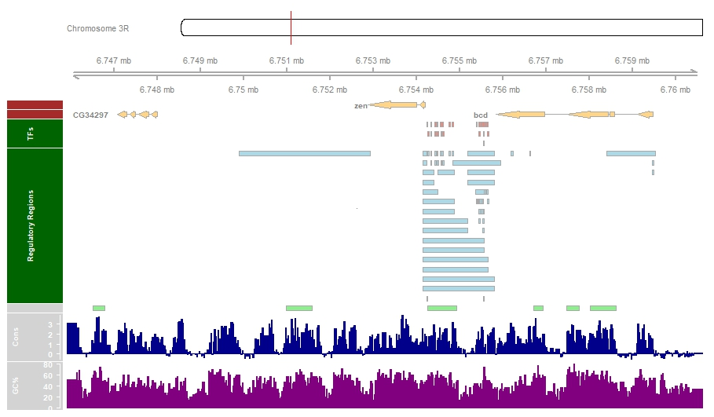
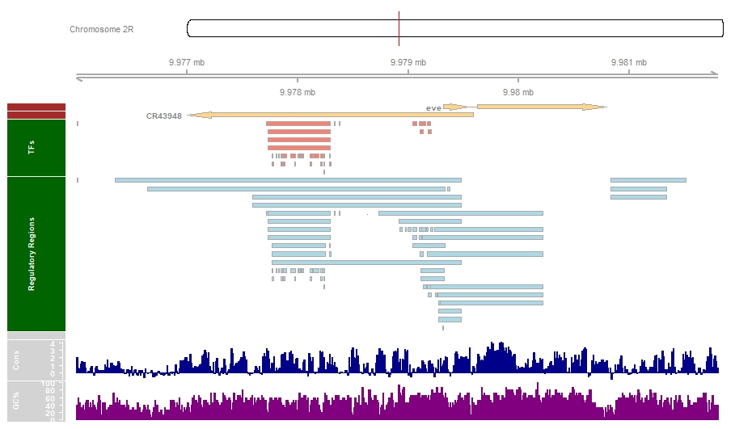
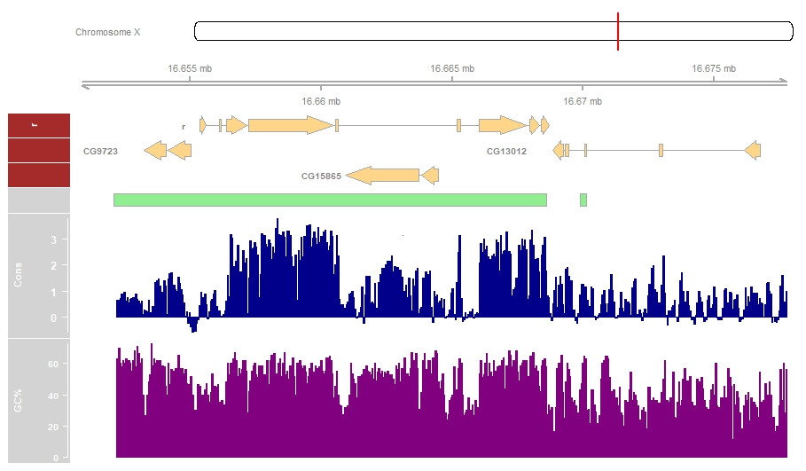

```{r setup, include=FALSE}
knitr::opts_chunk$set(echo = TRUE)
```

# Introduction

InterMineR constitutes an R package that interacts with InterMine, a data warehouse framework, which provides the ability to access, retrieve and analyze rapidly a variety of biological data [@Smith2012;@Kalderimis2014].

In this tutorial we will use the functionality of the InterMineR package to retrieve various information about the genomic regions that contain the *Drosophila melanogaster* genes zen, eve and r.

Then, we will visualize this information using the [Gviz](https://bioconductor.org/packages/release/bioc/html/Gviz.html) package [@Hahne2016].

```{r load_packages_models_templates, warning=FALSE, message=FALSE}
# load packages
library(InterMineR)
library(Gviz)

# load FlyMine and HumanMine 
im.fly = initInterMine(listMines()["FlyMine"])

# load templates
templates.fly = getTemplates(im.fly)

# load data models
model.fly = getModel(im.fly)
```

# Retrieve information about zen, eve and r genes with the Template Queries of InterMineR

First, we will create a new query to retrieve gene identifiers and genomic information for zen, eve and r.

There are two ways to build a query in InterMineR. We can either build a query as a list object with `newQuery` function, and assign all input values (selection of retrieved data type, constraints, etc.) as items of that list:

```{r gene_info, warning=FALSE, message=FALSE}
# Build new query to retrieve information for zen, eve, and r Drosophila genes

# Get Gene types from FlyMine model
head(subset(model.fly, type == "Gene"), 3)

gene_info.list = as.list(1:3)
for(i in 1:3){
  
  gene = c("zen", "eve", "r")[i]
  
  # define new query
  queryGeneIds = newQuery()
  queryGeneIds
  
  # set name
  queryGeneIds$name = "Gene identifiers"
  
  # set columns
  queryGeneIds$select = c(
    "Gene.primaryIdentifier",
    "Gene.secondaryIdentifier",
    "Gene.symbol",
    "Gene.id",
    "Gene.chromosome.primaryIdentifier",
    "Gene.chromosomeLocation.start",
    "Gene.chromosomeLocation.end",
    "Gene.chromosomeLocation.strand"
  )
  
  # set sort order
  queryGeneIds$orderBy = list(
    c(Gene.secondaryIdentifier = "ASC")
  )
  
  # set constraints
  newConstraint1 = list(
    path = "Gene",
    op = "LOOKUP",
    value = gene,
    code = "A"
  )
  queryGeneIds$where = list(newConstraint1)
  
  # run query and store results
  gene_info.list[[i]] = runQuery(im = im.fly, qry = queryGeneIds)
}

# concatenate to data.frame
gene_info.list = do.call(rbind, gene_info.list)

# print dimensions
print(dim(gene_info.list))
```

Or we can build the query as an `InterMineR-class` object with the functions `setConstraint`, which allows us to generate a new or modify an existing list of constraints, and `setQuery`, which generates the query as a `InterMineR-class` object:

```{r gene_info_InterMineR, warning=FALSE, message=FALSE}
# set constraints
constraints = setConstraints(
  paths = "Gene" ,
  operators = "LOOKUP",
  values = list(c("zen", "eve", "r"))
)

# define new query
queryGeneIds = setQuery(
  select = c(
    "Gene.primaryIdentifier",
    "Gene.secondaryIdentifier",
    "Gene.symbol",
    "Gene.id",
    "Gene.chromosome.primaryIdentifier",
    "Gene.chromosomeLocation.start",
    "Gene.chromosomeLocation.end",
    "Gene.chromosomeLocation.strand"
  ),
  where = constraints
) 

# run query and store results
gene_info = runQuery(im = im.fly, 
                     qry = queryGeneIds)

# print dimensions
print(dim(gene_info))
```

As it is demonstrated below, `setConstraints` and `setQuery` functions are designed to facilitate the generation of queries for InterMine instances and avoid using multiple iterative loops, especially when it is required to include multiple constraints or constraint values (e.g. genes, organisms) in your query.

```{r comparison, message=FALSE, warning=FALSE}
# compare the results from both type of queries
all(gene_info == gene_info.list)

gene_info
```

Now that we have the identifiers and the genomic information for zen, eve and r (Genes of Interest, GOIs), we can use Template Queries to retrieve information about:

1. The exons that comprise our GOIs
2. The genes that are adjacent to our GOIs
3. The genes that overlap with our GOIs

```{r Define_Template_Queries_1, warning=FALSE, message=FALSE}
# Retrieve Template Queries:

# Use Gene_ExonLocation2 template query to get the exons for the genes of interest
queryExons = getTemplateQuery(
  im.fly,
  name = "Gene_ExonLocation2")

# Use Gene_AdjacentGenes template query to get the adjacent genes
queryGeneAdjacentGenes = getTemplateQuery(
  im = im.fly,
  name = "Gene_AdjacentGenesLocations"
)

# Use Gene_OverlapppingGenes template query to get the overlapping genes
queryGeneOverlapppingGenes = getTemplateQuery(
  im.fly, 
  name = "Gene_OverlapppingGenes"
)
```

Having retrieved the necessary template queries, we iterate through our GOIs and retrieve the appropriate gene identifiers for each query. 

These identifiers will be used to modify the constraints of each query before we run it.

```{r run_Template_Queries_1, warning=FALSE, message=FALSE}
for(i in 1:3){
  
  gene = c("zen", "eve", "r")[i]
  
  # 1. Gene_ExonLocation2
  
  # set Gene.secondaryIdentifier value
  queryExons$where[[1]]$value = gene_info[which(gene_info$Gene.symbol == gene),2]
  
  # or alternatively use setConstraints function
  queryExons$where = setConstraints(
    modifyQueryConstraints = queryExons,
    m.index = 1,
    values = list(gene_info[which(gene_info$Gene.symbol == gene),2])
  )
  
  # run query and save results
  assign(
    x = paste0(gene,".Exons"),
    value = runQuery(im.fly, queryExons)
  )
  
  # 2. Gene_AdjacentGenes
  
  # change the value of the third constraint of the Gene_AdjacentGenes query with the
  # Gene.secondaryIdentifier of the genes of interest
  queryGeneAdjacentGenes$where[[3]]$value = gene_info$Gene.secondaryIdentifier[i]
  
  # or alternatively use setConstraints function
  queryGeneAdjacentGenes$where = setConstraints(
    modifyQueryConstraints = queryGeneAdjacentGenes,
    m.index = 3,
    values = list(gene_info$Gene.secondaryIdentifier[i])
  )
  
  # assign the adjacent gene information to each gene of interest
  assign(x = paste0(gene_info$Gene.symbol[i], "_AdjacentGenes"),
         value = runQuery(im.fly, queryGeneAdjacentGenes))
  
  if(is.null(get(paste0(gene_info$Gene.symbol[i], "_AdjacentGenes")))){
    print(paste0(gene_info$Gene.symbol[i], " query returns no adjacent genes"))
  }
  
  # 3. Gene_OverlapppingGenes
  
  queryGeneOverlapppingGenes$where[[2]]$value = gene_info$Gene.secondaryIdentifier[i]
  
  # or alternatively use setConstraints function
  queryGeneOverlapppingGenes$where = setConstraints(
    modifyQueryConstraints = queryGeneOverlapppingGenes,
    m.index = 2,
    values = list(gene_info$Gene.secondaryIdentifier[i])
  )
  
  assign(x = paste0(gene_info$Gene.symbol[i], "_OverlappingGenes"),
         value = runQuery(im.fly, queryGeneOverlapppingGenes))
  
  if(is.null(get(paste0(gene_info$Gene.symbol[i], "_OverlappingGenes")))){
    
    print(paste0(gene_info$Gene.symbol[i], " query returns no overlapping genes"))
  }
  
}
```

```{r head_overlapping_adjacent, warning=FALSE, message=FALSE}
# show adjacent genes
head(zen_AdjacentGenes, 3)
head(r_AdjacentGenes, 3)

# show overlapping genes
head(eve_OverlappingGenes, 3)
head(r_OverlappingGenes, 3)
```

Only the queries about the r gene return both adjacent and overlapping genes.

The queries for genes zen and eve return only the adjacent and the overlapping genes respectively. 

# Defining Genomic Regions of Interest that contain zen, eve and r, along with their respective adjacent and/or overlapping genes.

It is time to define the Genomic Regions of Interest (ROIs) for which we will retrieve even more features.

To do so we will add 1000 bases in both sides of GOIs, taking also into consideration the start and the end of the adjacent and/or the overlapping genes.

```{r ROIs, warning=FALSE, message=FALSE}
# get genomic region of zen, eve, r and their respective 
# adjacent and/or overlapping genes.
# Add 1000 bp on both sides of this region!

# chromosome region of interest (ROI) containing zen and adjacent genes
zen.ROI.start = min(
  as.numeric(zen_AdjacentGenes[,grep("start", colnames(zen_AdjacentGenes))])
  ) - 1000
zen.ROI.end = max(
  as.numeric(zen_AdjacentGenes[,grep("end", colnames(zen_AdjacentGenes))])
  ) + 1000

# chromosome region of interest (ROI) containing eve and overlapping genes
eve.ROI.start = min(
  as.numeric(eve_OverlappingGenes[,grep("start", colnames(eve_OverlappingGenes))])
  ) - 1000
eve.ROI.end = max(
  as.numeric(eve_OverlappingGenes[,grep("end", colnames(eve_OverlappingGenes))])
  ) + 1000

# chromosome region of interest (ROI) containing r, adjacent and overlapping genes
r.ROI.start = min(
  as.numeric(
    c(r_OverlappingGenes[,grep("start", colnames(r_OverlappingGenes))],
      r_AdjacentGenes[,grep("start", colnames(r_AdjacentGenes))])
  )
) - 1000

r.ROI.end = max(
  as.numeric(
    c(r_OverlappingGenes[,grep("end", colnames(r_OverlappingGenes))],
      r_AdjacentGenes[,grep("end", colnames(r_AdjacentGenes))])
  )
) + 1000
```

# Retrieve information about the Genomic Regions of Interest with the Template Queries of InterMineR

With our ROIs well-defined, it is time to retrieve specifically:

1. the Transcription Factor (TF) binding sites, retrieved by REDfly database, as well as
2. all Regulatory Regions (RRs) for each of them.

Template queries **ChromLocation_TFBindingSiteLocationGeneFactor** and **ChromLocation_RegulatoryRegion** will be used for this purpose.

```{r Define_Template_Queries_2, warning=FALSE, message=FALSE}
# find all transcription factor (TF) binding sites within the ROIs
# by using the ChromLocation_TFBindingSiteLocationGeneFactor template query
queryTFBindingSites = getTemplateQuery(
  im.fly,
  "ChromLocation_TFBindingSiteLocationGeneFactor"
)

# find all Regulatory Regions (RRs) within the ROIs
# by using the ChromLocation_RegulatoryRegion template query
queryRRLocations = getTemplateQuery(
  im.fly, "ChromLocation_RegulatoryRegion"
)
```

As before, the appropriate gene identifiers will be used to modify the constraints of our queries before we run them.

```{r run_Template_Queries_2, warning=FALSE, message=FALSE}
for(i in 1:3){
  
  gene = c("zen", "eve", "r")[i]
  
  # 1. ChromLocation_TFBindingSiteLocationGeneFactor
  
  # set chromosome value
  queryTFBindingSites$where[[3]]$value = gene_info[which(gene_info$Gene.symbol == gene),5]
  
  # set location start
  queryTFBindingSites$where[[4]]$value = as.character(get(paste0(gene,".ROI.start")))
  
  # set location end
  queryTFBindingSites$where[[5]]$value = as.character(get(paste0(gene,".ROI.end")))
  
  # or alternatively use setConstraints function
  queryTFBindingSites$where = setConstraints(
    modifyQueryConstraints = queryTFBindingSites,
    m.index = 3:5,
    values = list(
      # set chromosome value
      gene_info[which(gene_info$Gene.symbol == gene),5],
      # set location start
      as.character(get(paste0(gene,".ROI.start"))),
      # set location end
      as.character(get(paste0(gene,".ROI.end")))
      )
  )
  
  # run query and save results
  assign(
    x = paste0(gene, ".ROI.TFBindingSites"),
    value = runQuery(im.fly, queryTFBindingSites)
  )
  
  if(is.null(get(paste0(gene, ".ROI.TFBindingSites")))){
    
    print(paste0(gene, " ROI query returns no TF binding sites from REDfly database"))
  }
  
  # 2. ChromLocation_RegulatoryRegion
  
  # set chromosome value
  queryRRLocations$where[[1]]$value = gene_info[which(gene_info$Gene.symbol == gene),5]
  
  # set location start
  queryRRLocations$where[[2]]$value = as.character(get(paste0(gene,".ROI.start")))
  
  # set location end
  queryRRLocations$where[[3]]$value = as.character(get(paste0(gene,".ROI.end")))
  
  # or alternatively use setConstraints function
  queryRRLocations$where = setConstraints(
    modifyQueryConstraints = queryRRLocations,
    m.index = 1:3,
    values = list(
      # set chromosome value
      gene_info[which(gene_info$Gene.symbol == gene),5],
      # set location start
      as.character(get(paste0(gene,".ROI.start"))),
      # set location end
      as.character(get(paste0(gene,".ROI.end")))
    )
  )
  
  # run query and save results
  assign(
    x = paste0(gene, ".ROI.RRLocations"),
    value = runQuery(im.fly, queryRRLocations)
  )
  
  if(is.null(get(paste0(gene, ".ROI.RRLocations")))){
    
    print(paste0(gene, " ROI query returns no RRs"))
  }
  
}
```

```{r head_TFBindingSites_RRs, warning=FALSE, message=FALSE}
head(zen.ROI.TFBindingSites, 3)
head(eve.ROI.TFBindingSites, 3)
head(r.ROI.TFBindingSites, 3)

head(zen.ROI.RRLocations, 3)
head(eve.ROI.RRLocations, 3)
head(r.ROI.RRLocations, 3)
```


# Retrieve information about the Genomic Regions of Interest with the Gviz::UcscTrack function

Finally, the Gviz::UcscTrack function allows us to retrieve extra information about the CpG islands, the Conservation score, and GC content of our ROIs.

```{r UcscTrack, warning=FALSE, message=FALSE, eval=FALSE}
for(i in 1:3){
  gene = c("zen", "eve", "r")[i]
  
  # set chromosome value
  chrom = paste0("chr",gene_info[which(gene_info$Gene.symbol == gene),5])
  
  # set the beginning and the end of the ROI
  gene.start = get(paste0(gene, ".ROI.start"))
  gene.end = get(paste0(gene, ".ROI.end"))
  
  # get CpG islands
  assign(
    x = paste0(gene, ".ROI.cpgIslands"),
    value = UcscTrack(genome = "dm6", chromosome = chrom,
                      track = "cpgIslandExt", 
                      from = gene.start, 
                      to = gene.end, 
                      trackType = "AnnotationTrack", 
                      start = "chromStart", 
                      end = "chromEnd", 
                      id = "name", 
                      shape = "box",
                      fill = "lightgreen",
                      name = "CpGs")
  )
  
  # get Conservation
  assign(
    x = paste0(gene, ".ROI.conservation"),
    value = UcscTrack(genome = "dm6", chromosome = chrom,
                      track = "Conservation", 
                      table = "phyloP27way",
                      from = gene.start, 
                      to = gene.end,
                      trackType = "DataTrack",
                      start = "start",
                      end = "end", 
                      data = "score",
                      type = "hist",
                      window = "auto", 
                      col.histogram = "darkblue",
                      fill.histogram = "darkblue", 
                      name = "Cons")
  )
  # get GC Percent
  assign(
    x = paste0(gene, ".ROI.gcContent"),
    value =  UcscTrack(genome = "dm6", chromosome = chrom,
                       track = "GC Percent", 
                       table = "gc5BaseBw", 
                       from = gene.start, 
                       to = gene.end, 
                       trackType = "DataTrack", start = "start",
                       end = "end", data = "score", type = "hist", 
                       window = "auto",
                       windowSize = 1500, fill.histogram = "#800080",
                       col.histogram = "#800080",
                       name = "GC%")
  )
}
```

# Visualize all information about the Genomic Regions of Interest

At this point, we are ready visualize all the information that we retrieved for the ROIs using Gviz package.

```{r GenomeAxisTrack, warning=FALSE, message=FALSE, eval=FALSE}
# Plot all features for the genes of interest
axTrack <- GenomeAxisTrack()
```

## Genomic Region of Interest containing zen

```{r zen_vis, warning=FALSE, message=FALSE, eval=FALSE}
# zen gene
idxTrack <- IdeogramTrack(genome = "dm6", chromosome = "chr3R")

# get Exons for zen adjacent genes
queryExons$where[[1]]$value = zen_AdjacentGenes$Gene.downstreamIntergenicRegion.adjacentGenes.symbol
zen.down.Exons = runQuery(im.fly, queryExons)

queryExons$where[[1]]$value = zen_AdjacentGenes$Gene.upstreamIntergenicRegion.adjacentGenes.symbol
zen.up.Exons = runQuery(im.fly, queryExons)

# get strand for zen ROI genes
zen.strand = gsub(
  pattern = "-1",
  replacement = "-",
  x = c(
    zen.Exons$Gene.exons.chromosomeLocation.strand
  )
)

zen.adjacent.strand = gsub(
  pattern = "-1",
  replacement = "-",
  x = c(
    zen.down.Exons$Gene.exons.chromosomeLocation.strand,
    zen.up.Exons$Gene.exons.chromosomeLocation.strand
  )
)

# index for zen gene_info
ind.gi = which(gene_info$Gene.symbol == "zen")

# zen data.frame for GeneRegionTrack
zenTrack = data.frame(
  chromosome = "chr3R",
  start = as.numeric(c(
    zen.Exons$Gene.exons.chromosomeLocation.start
  )),
  end = as.numeric(c(
    zen.Exons$Gene.exons.chromosomeLocation.end
  )),
  strand = zen.strand,
  feature = "protein-coding",
  gene = gene_info[ind.gi,1],
  exon = c(
    zen.Exons$Gene.exons.primaryIdentifier
  ),
  transcript = "zen"
)

zenTrack <- GeneRegionTrack(zenTrack,
                            genome = "dm6",
                            chromosome = "chr3R",
                            name = "zen", 
                            background.title = "brown",
                            transcriptAnnotation = "transcript"
)

# zen Adjacent genes data.frame for GeneRegionTrack
zenAdjacentTrack = data.frame(
  chromosome = "chr3R",
  start = as.numeric(c(
    zen.down.Exons$Gene.exons.chromosomeLocation.start,
    zen.up.Exons$Gene.exons.chromosomeLocation.start
  )),
  end = as.numeric(c(
    zen.down.Exons$Gene.exons.chromosomeLocation.end,
    zen.up.Exons$Gene.exons.chromosomeLocation.end
  )),
  strand = zen.adjacent.strand,
  exon = c(
    zen.down.Exons$Gene.exons.primaryIdentifier,
    zen.up.Exons$Gene.exons.primaryIdentifier
  ),
  transcript = c(
    rep(zen_AdjacentGenes$Gene.downstreamIntergenicRegion.adjacentGenes.symbol,nrow(zen.down.Exons)),
    rep(zen_AdjacentGenes$Gene.upstreamIntergenicRegion.adjacentGenes.symbol, nrow(zen.up.Exons))
  )
)

zenAdjacentTrack <- GeneRegionTrack(zenAdjacentTrack,
                            genome = "dm6",
                            chromosome = "chr3R",
                            name = "zen Adjacent Genes", 
                            transcriptAnnotation = "transcript",
                            background.title = "brown"
                            )

# zen ROI TFbinding sites for GeneRegionTrack

zen.ROI.TFBindingSites.track = data.frame(
  chromosome = paste0("chr",zen.ROI.TFBindingSites$TFBindingSite.chromosome.primaryIdentifier),
  start = as.numeric(zen.ROI.TFBindingSites$TFBindingSite.chromosomeLocation.start),
  end = as.numeric(zen.ROI.TFBindingSites$TFBindingSite.chromosomeLocation.end),
  symbol = zen.ROI.TFBindingSites$TFBindingSite.factor.name
)

zen.ROI.TFBindingSites.track = GeneRegionTrack(
  zen.ROI.TFBindingSites.track,
  genome = "dm6",
  chromosome = "chr3R",
  name = "TFs",
  background.title = "darkgreen",
  fill = "salmon"
)

# zen ROI Regulatory Regions for GeneRegionTrack

zen.ROI.RRLocations.track = data.frame(
  chromosome = paste0("chr",zen.ROI.RRLocations$RegulatoryRegion.chromosome.primaryIdentifier),
  start = as.numeric(zen.ROI.RRLocations$RegulatoryRegion.chromosomeLocation.start),
  end = as.numeric(zen.ROI.RRLocations$RegulatoryRegion.chromosomeLocation.end),
  symbol = zen.ROI.RRLocations$RegulatoryRegion.primaryIdentifier
)

zen.ROI.RRLocations.track = GeneRegionTrack(
  zen.ROI.RRLocations.track,
  genome = "dm6",
  chromosome = "chr3R",
  name = "Regulatory Regions",
  background.title = "darkgreen",
  fill = "lightblue"
)


plotTracks(list(idxTrack, 
                axTrack, 
                zenTrack,
                zenAdjacentTrack,
                zen.ROI.TFBindingSites.track,
                zen.ROI.RRLocations.track,
                zen.ROI.cpgIslands, 
                zen.ROI.conservation, 
                zen.ROI.gcContent),
           showTitle = T,
           shape = "arrow")
```

 

## Genomic Region of Interest containing eve 

```{r eve_vis, warning=FALSE, message=FALSE, eval=FALSE}
# eve gene
idxTrack <- IdeogramTrack(genome = "dm6", chromosome = "chr2R")

# get Exons for eve overlapping genes
queryExons$where[[1]]$value = eve_OverlappingGenes$Gene.overlappingFeatures.symbol
eve.over.Exons = runQuery(im.fly, queryExons)


# get strand for eve ROI genes
eve.strand = gsub(
  pattern = "1",
  replacement = "+",
  x = c(
    eve.Exons$Gene.exons.chromosomeLocation.strand
  )
)

eve.over.strand = gsub(
  pattern = "-1",
  replacement = "-",
  x = c(
    eve.over.Exons$Gene.exons.chromosomeLocation.strand
  )
)

# index for eve gene_info
ind.gi = which(gene_info$Gene.symbol == "eve")

# eve data.frame for GeneRegionTrack
eveTrack = data.frame(
  chromosome = "chr2R",
  start = as.numeric(c(
    eve.Exons$Gene.exons.chromosomeLocation.start
  )),
  end = as.numeric(c(
    eve.Exons$Gene.exons.chromosomeLocation.end
  )),
  strand = eve.strand,
  feature = "protein-coding",
  gene = gene_info[ind.gi,1],
  exon = c(
    eve.Exons$Gene.exons.primaryIdentifier
  ),
  transcript = "eve"
)

eveTrack <- GeneRegionTrack(eveTrack,
                            genome = "dm6",
                            chromosome = "chr2R",
                            name = "eve", 
                            background.title = "brown",
                            transcriptAnnotation = "transcript"
)

# eve Adjacent genes data.frame for GeneRegionTrack
eveOverlapTrack = data.frame(
  chromosome = "chr2R",
  start = as.numeric(c(
    eve.over.Exons$Gene.exons.chromosomeLocation.start
  )),
  end = as.numeric(c(
    eve.over.Exons$Gene.exons.chromosomeLocation.end
  )),
  strand = eve.over.strand,
  exon = c(
    eve.over.Exons$Gene.exons.primaryIdentifier
  ),
  transcript = c(
    eve_OverlappingGenes$Gene.overlappingFeatures.symbol
  )
)

eveOverlapTrack <- GeneRegionTrack(eveOverlapTrack,
                                    genome = "dm6",
                                    chromosome = "chr2R",
                                    name = "eve Overlapping Genes", 
                                    transcriptAnnotation = "transcript",
                                    background.title = "brown"
)

# eve ROI TFbinding sites for GeneRegionTrack

eve.ROI.TFBindingSites.track = data.frame(
  chromosome = paste0("chr",eve.ROI.TFBindingSites$TFBindingSite.chromosome.primaryIdentifier),
  start = as.numeric(eve.ROI.TFBindingSites$TFBindingSite.chromosomeLocation.start),
  end = as.numeric(eve.ROI.TFBindingSites$TFBindingSite.chromosomeLocation.end),
  symbol = eve.ROI.TFBindingSites$TFBindingSite.factor.name
)

eve.ROI.TFBindingSites.track = GeneRegionTrack(
  eve.ROI.TFBindingSites.track,
  genome = "dm6",
  chromosome = "chr2R",
  name = "TFs",
  background.title = "darkgreen",
  fill = "salmon"
)

# eve ROI Regulatory Regions for GeneRegionTrack

eve.ROI.RRLocations.track = data.frame(
  chromosome = paste0("chr",eve.ROI.RRLocations$RegulatoryRegion.chromosome.primaryIdentifier),
  start = as.numeric(eve.ROI.RRLocations$RegulatoryRegion.chromosomeLocation.start),
  end = as.numeric(eve.ROI.RRLocations$RegulatoryRegion.chromosomeLocation.end),
  symbol = eve.ROI.RRLocations$RegulatoryRegion.primaryIdentifier
)

eve.ROI.RRLocations.track = GeneRegionTrack(
  eve.ROI.RRLocations.track,
  genome = "dm6",
  chromosome = "chr2R",
  name = "Regulatory Regions",
  background.title = "darkgreen",
  fill = "lightblue"
)


plotTracks(list(idxTrack, 
                axTrack, 
                eveTrack,
                eveOverlapTrack,
                eve.ROI.TFBindingSites.track,
                eve.ROI.RRLocations.track,
                eve.ROI.cpgIslands, 
                eve.ROI.conservation, 
                eve.ROI.gcContent),
           showTitle = T,
           shape = "arrow")
```



## Genomic Region of Interest containing r

```{r r_vis, warning=FALSE, message=FALSE, eval=FALSE}
# r gene
idxTrack <- IdeogramTrack(genome = "dm6", chromosome = "chrX")

# get Exons for r adjacent genes
queryExons$where[[1]]$value = r_AdjacentGenes$Gene.downstreamIntergenicRegion.adjacentGenes.symbol
r.down.Exons = runQuery(im.fly, queryExons)

queryExons$where[[1]]$value = r_AdjacentGenes$Gene.upstreamIntergenicRegion.adjacentGenes.symbol
r.up.Exons = runQuery(im.fly, queryExons)

# get Exons for r adjacent genes
queryExons$where[[1]]$value = r_OverlappingGenes$Gene.overlappingFeatures.symbol
r.over.Exons = runQuery(im.fly, queryExons)

# get strand for r ROI genes
r.strand = gsub(
  pattern = "1",
  replacement = "+",
  x = c(
    r.Exons$Gene.exons.chromosomeLocation.strand
  )
)

r.adjacent.strand = gsub(
  pattern = "-1",
  replacement = "-",
  x = c(
    r.down.Exons$Gene.exons.chromosomeLocation.strand,
    r.up.Exons$Gene.exons.chromosomeLocation.strand
  )
)

r.over.strand = gsub(
  pattern = "-1",
  replacement = "-",
  x = c(
    r.over.Exons$Gene.exons.chromosomeLocation.strand
  )
)

# index for r gene_info
ind.gi = which(gene_info$Gene.symbol == "r")

# r data.frame for GeneRegionTrack
rTrack = data.frame(
  chromosome = "chrX",
  start = as.numeric(c(
    r.Exons$Gene.exons.chromosomeLocation.start
  )),
  end = as.numeric(c(
    r.Exons$Gene.exons.chromosomeLocation.end
  )),
  strand = r.strand,
  feature = "protein-coding",
  gene = gene_info[ind.gi,1],
  exon = c(
    r.Exons$Gene.exons.primaryIdentifier
  ),
  transcript = "r"
)

rTrack <- GeneRegionTrack(rTrack,
                            genome = "dm6",
                            chromosome = "chrX",
                            name = "r", 
                            background.title = "brown",
                            transcriptAnnotation = "transcript"
)

# r Adjacent genes data.frame for GeneRegionTrack
rAdjacentTrack = data.frame(
  chromosome = "chrX",
  start = as.numeric(c(
    r.down.Exons$Gene.exons.chromosomeLocation.start,
    r.up.Exons$Gene.exons.chromosomeLocation.start
  )),
  end = as.numeric(c(
    r.down.Exons$Gene.exons.chromosomeLocation.end,
    r.up.Exons$Gene.exons.chromosomeLocation.end
  )),
  strand = r.adjacent.strand,
  exon = c(
    r.down.Exons$Gene.exons.primaryIdentifier,
    r.up.Exons$Gene.exons.primaryIdentifier
  ),
  transcript = c(
    rep(r_AdjacentGenes$Gene.downstreamIntergenicRegion.adjacentGenes.symbol,nrow(r.down.Exons)),
    rep(r_AdjacentGenes$Gene.upstreamIntergenicRegion.adjacentGenes.symbol, nrow(r.up.Exons))
  )
)

rAdjacentTrack <- GeneRegionTrack(rAdjacentTrack,
                                    genome = "dm6",
                                    chromosome = "chrX",
                                    name = "r Adjacent Genes", 
                                    transcriptAnnotation = "transcript",
                                    background.title = "brown"
)

# r Overlapping genes data.frame for GeneRegionTrack
rOverTrack = data.frame(
  chromosome = "chrX",
  start = as.numeric(c(
    r.over.Exons$Gene.exons.chromosomeLocation.start
  )),
  end = as.numeric(c(
    r.over.Exons$Gene.exons.chromosomeLocation.end
  )),
  strand = r.over.strand,
  exon = c(
    r.over.Exons$Gene.exons.primaryIdentifier
  ),
  transcript = c(
    r_OverlappingGenes$Gene.overlappingFeatures.symbol
  )
)

rOverTrack <- GeneRegionTrack(rOverTrack,
                                  genome = "dm6",
                                  chromosome = "chrX",
                                  name = "r Overlapping Genes", 
                                  transcriptAnnotation = "transcript",
                                  background.title = "brown"
)

# r ROI TFbinding sites for GeneRegionTrack
is.null(r.ROI.TFBindingSites)

# r ROI Regulatory Regions for GeneRegionTrack
is.null(r.ROI.RRLocations)

plotTracks(list(idxTrack, 
                axTrack, 
                rTrack,
                rAdjacentTrack,
                rOverTrack,
                r.ROI.cpgIslands, 
                r.ROI.conservation, 
                r.ROI.gcContent),
           showTitle = T,
           shape = "arrow")
```



# System info

```{r sessioInfo}
sessionInfo()
```

# References
