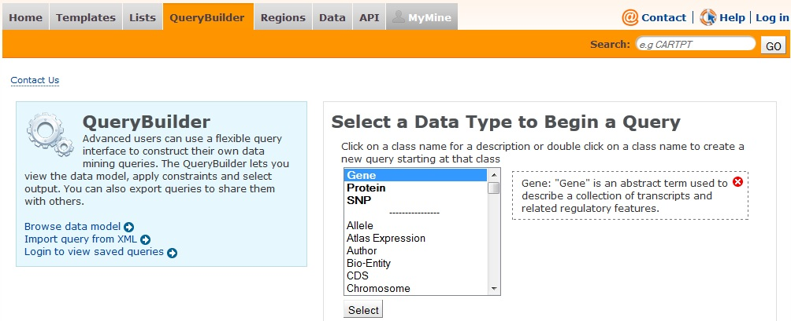
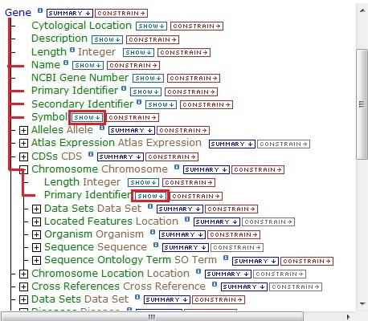
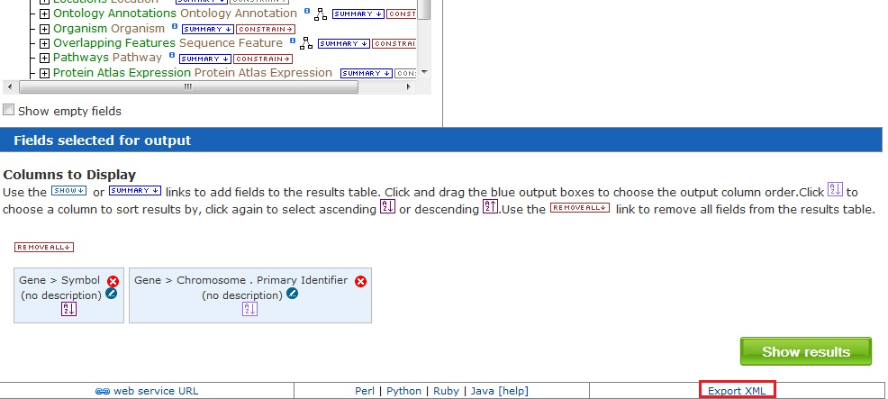
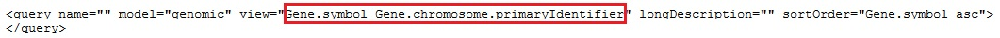

```{r setup, include=FALSE}
knitr::opts_chunk$set(echo = TRUE)
```

# Introduction

InterMine is a powerful open source data warehouse system integrating diverse biological data sets (e.g. genomic, expression and protein data) for various organisms. Integrating data makes it possible to run sophisticated data mining queries that span domains of biological knowledge. A selected list of databases powered by InterMine is shown in
Table 1:

Database | Organism | Data |
---------|----------|------|
FlyMine | *Drosophila* | Genes, homology, proteins, interactions, gene ontology, expression, regulation, phenotypes, pathways, diseases, resources, publications
HumanMine | *H. sapiens* | Genomics, SNPs, GWAS, proteins, gene ontology, pathways, gene expression, interactions, publications, disease, orthologues, alleles
MouseMine | *M. musculus* | Genomics, proteins, gene ontology, expression, interactions, pathways, phenotypes, diseases, homology, publications
RatMine | *R. norvegicus* | Disease, gene ontology, genomics, interactions, phenotype, pathway, proteins, publication QTL, SNP
WormMine | *C. elegans* | Genes, alleles, homology, go annotation, phenotypes, strains
YeastMine | *S. cerevisiae* | Genomics, proteins, gene ontology, comparative genomics, phenotypes, interactions, literature, pathways, gene expression
ZebrafishMine | *D. rerio* | Genes, constructs, disease, gene ontology, genotypes, homology, morpholinos, phenotypes
TargetMine | *H. sapiens, M. musculus* | Genes, protein structures, chemical compounds, protein domains, gene function, pathways, interactions, disease, drug targets
MitoMiner | *H. sapiens, M. musculus, R. norvegicus, D. rerio, S. cerevisiae, S. pombe* | Genes, homology, localisation evidence, Mitochondrial reference gene lists, phenotypes, diseases, expression, interactions, pathways, exome
IndigoMine | *Archae* | Genomics
ThaleMine | *A. thaliana* | Genomics, proteins, domains, homology, gene ontology, interactions, expression, publications, pathways, GeneRIF, stocks, phenotypes, alleles, insertions, TAIR
MedicMine | *Medicago truncatula* | Genomics, pathways, gene ontology, publications, proteins, homology
PhytoMine | *over 50 plant genomes* | Genes, proteins, expression, transcripts, homology
 

*Please see the InterMine home page for a full list of available InterMines.*

InterMine includes an attractive, user-friendly web interface that works 'out of the box' and a powerful, scriptable web-service API to allow programmatic access to your data. This R package provides an interface with the InterMine-powered databases through Web services.

# Jumpstart: How to build queries using InterMineR

Let's start with a simple task - find the homologues of gene ABO.

## Select a database

First, we look at what databases are available.

```{r load, warning=FALSE, message=FALSE}
library(InterMineR)
listMines()
```

Since we would like to query human genes, we select HumanMine.

```{r humanmine, warning=FALSE, message=FALSE}

# load HumaMine
im <- initInterMine(mine=listMines()["HumanMine"])
im

```

## Obtain a prebuilt query

In InterMine you are able to build custom queries, but using R you are only allowed to
run pre-built queries -- called templates. Templates are queries that have already been
created with a fixed set of output columns and one or more constraints.

```{r get_queries, warning=FALSE, message=FALSE}
# Get template (collection of pre-defined queries)
template = getTemplates(im)
head(template)
```

We would like to find templates involving genes.

```{r gene_templates, warning=FALSE, message=FALSE}

# Get gene-related templates
template[grep("gene", template$name, ignore.case=TRUE),]

```

The template Gene_Orth seems to be what we want. Let's look at this template in more detail.

```{r gene_orthologs, warning=FALSE, message=FALSE}
# Query for gene orthologs
queryGeneOrth = getTemplateQuery(
  im = im, 
  name = "Gene_Orth"
)
queryGeneOrth

```

There are three essential members in a query - SELECT, WHERE and constraintLogic.

1. SELECT
    a. The SELECT (or view) represents the output columns in the query output.
    b. Columns of a view are usually of the form "A.B", where B is the child of A. For example in the column Gene.symbol, symbol is the child of Gene.
    Columns could also be in cascade form "A.B.C". For example, in the column Gene.locations.start, locations is the child of Gene and start is the child of locations.
2. WHERE
    a. The WHERE statement is a collection of constraints.
    b. Query constraints include a list of the following columns:
        i. **path**
            1. in the same format as view columns
        ii. **op**
            1. the constraint operator
            2. Valid values: "=", "!=", "LOOKUP", "ONE OF", "NONE OF", ">", "<", ">=", "<=", "LIKE"
        iii. **value**
            1. the constraint value
        iv. code
            1. Ignore
            2. The logic code for the constraint (e.g. A, B or C).
            3. Only used in the constrainLogic (discussed below
        v. extraValue
            1. optional, required for LOOKUP constraints
            2. Short name of organism, e.g. *H. sapiens*
            vi. Editable
                1. Ignore
                2. Used to determine if user is allowed to edit this constraint.
                Only for the UI.
        vii. Switchable
                1. Ignore
                2. Used to determine if user is allowed to disable this constraint.   
                Only for the UI.
        viii. Switched
                1. Ignore
                2. Used to determine if user has enabled this constraint. 
                Only for the UI.
3. constraintLogic
    a. Constraint Logic, if not explicitly given, is "AND" operation, e.g., "A and B", where A and B are the codes in the constraints.
    
### Look at the data model

What does 'Gene.symbol' mean? What is 'Gene.homologues.homologue.symbol'?

Let's take a look at the data model.

```{r getModel, warning=FALSE, message=FALSE}

model <- getModel(im)
head(model)

```

Let's look at the children of the Gene data type.

```{r gene_type_data, warning=FALSE, message=FALSE}

model[which(model$type=="Gene"),]

```

Gene has a field called 'symbol' (hence the column Gene.symbol). Gene also has a child called homologues, which is of the Homologue data type.

```{r homologue_type, warning=FALSE, message=FALSE}

model[which(model$type=="Homologue"),]

```

Homologue has a child called 'gene' which is of the type 'Gene', which we saw above has a field called 'symbol' (hence the column Gene.homologues.homologue.symbol).

## Run a Query
Let's now run our template.

```{r run_geneorth, warning=FALSE, message=FALSE}

resGeneOrth <- runQuery(im, queryGeneOrth)
head(resGeneOrth)

```

# Modify a Query
## Edit a constraint

Let's modify the query to find the orthologues of the gene ABO. We want to change the 'value' attribute from PPARG to ABO.

There are two ways to build a query in InterMineR. 

1. We can either build a query as a list object with `newQuery` function, and assign all input values (selection of retrieved data type, constraints, etc.) as items of that list,

2. rr we can build the query as an `InterMineR-class` object with the functions `setConstraint`, which allows us to generate a new or modify an existing list of constraints, and `setQuery`, which generates the query as a `InterMineR-class` object.

`setConstraints` and `setQuery` functions are designed to facilitate the generation of queries for InterMine instances and avoid using multiple iterative loops, especially when it is required to include multiple constraints or constraint values (e.g. genes, organisms) in your query.

```{r modify_query, warning=FALSE, message=FALSE}

# modify directly the value of the first constraint from the list query
queryGeneOrth$where[[1]][["value"]] <- "ABO"

# or modify the value of the first constraint from the list query with setConstraints
queryGeneOrth$where = setConstraints(
  modifyQueryConstraints = queryGeneOrth,
  m.index = 1,
  values = list("ABO")
)

queryGeneOrth$where

```

Note the value is now equal to 'ABO'. Let's rerun our query with the new constraint.

```{r modify_query2, warning=FALSE, message=FALSE}

resGeneOrth <- runQuery(im, queryGeneOrth)
head(resGeneOrth)

```

Now we are seeing orthologues for the ABO gene. Let's add the organism to the view to make sure we are looking at the desired gene.

## Add a new constraint

You can also add additional filters. Let's exclude all homologues where organism is *H.
sapiens*.

There are four parts of a constraint to add:

1. path
    a. I got the path from the output columns but I could have figured out it from the data model.
2. op
    a. Valid values: "=", "!=", "LOOKUP", "ONE OF", "NONE OF", ">", "<", ">=", "<=", "LIKE"
3. value
    a. What value I am filtering on.
4. code
    a. Must be a letter not in use by the query already. Looking at the query output above we can see we only have one constraint, labelled 'A'. Let's use 'B' for our code.

```{r new_constraint, warning=FALSE, message=FALSE}
newConstraint <- list(
  path=c("Gene.homologues.homologue.organism.shortName"),
  op=c("!="), 
  value=c("H. sapiens"), 
  code=c("B")
)

queryGeneOrth$where[[2]] <- newConstraint
queryGeneOrth$where

```

Our new filter has been added successfully. Rerun the query and you see you only have non-Homo sapiens orthologues.

```{r new_constraint2, warning=FALSE, message=FALSE}
resGeneOrth <- runQuery(im, queryGeneOrth)
resGeneOrth
```

## Add a column

You can also add additional columns to the output. For instance, where do these homologues come from? Let's add this information.

Let's see what we know about homologues.

```{r add_column, warning=FALSE, message=FALSE}
model[which(model$type=="Homologue"),]
```

The Homologue data type has an 'dataSets' reference of type 'DataSet'.

```{r add_column2, warning=FALSE, message=FALSE}
model[which(model$type=="DataSet"),]
```

DataSet has a child called name. Add Gene.homologues.dataSets.name to the view. We'll add it as the last column, we can see from above there are 5 other columns already so we'll put it as #6:

```{r add_column3, warning=FALSE, message=FALSE}

# use setQuery function which will create an InterMineR-class query
queryGeneOrth.InterMineR = setQuery(
  inheritQuery = queryGeneOrth,
  select = c(queryGeneOrth$select, 
             "Gene.homologues.dataSets.name")
  )

queryGeneOrth.InterMineR@select

# or assign new column directly to the existing list query
queryGeneOrth$select[[6]] <- "Gene.homologues.dataSets.name"
queryGeneOrth$select

# run queries
resGeneOrth.InterMineR <- runQuery(im, queryGeneOrth.InterMineR)
resGeneOrth <- runQuery(im, queryGeneOrth)

all(resGeneOrth == resGeneOrth.InterMineR)

head(resGeneOrth, 3)

```

NB: adding columns can result in changing the row count.

## Change constraint logic

The constraintLogic, if not given, is 'A and B'. We would now try to explicitly specify the constraintLogic. A and B corresponds to the 'code' for each constraint.

```{r constrant_logic, warning=FALSE, message=FALSE}

queryGeneOrth$constraintLogic <- "A and B"
queryGeneOrth$constraintLogic

```

Run the query again and see no change:

```{r constrant_logic2, warning=FALSE, message=FALSE}

resGeneOrth <- runQuery(im, queryGeneOrth)
resGeneOrth

```

Change to be 'A or B' and see how the results change.

# Recipes

## Obtain the gene ontology (GO) terms associated with gene ABO

>- Start with the template Gene GO

```{r gene_go, warning=FALSE, message=FALSE}

queryGeneGO <- getTemplateQuery(im, "Gene_GO")
queryGeneGO

```

>- Modify the view to display a compact view

```{r gene_go2, warning=FALSE, message=FALSE}

queryGeneGO$select <- queryGeneGO$select[2:5]
queryGeneGO$select

```

>- Modify the constraints to look for gene ABO.

```{r gene_go3, warning=FALSE, message=FALSE}
queryGeneGO$where[[1]][["value"]] <- "ABO"
queryGeneGO$where
```

>- Run the query

```{r gene_go4, warning=FALSE, message=FALSE}
resGeneGO <- runQuery(im, queryGeneGO )
head(resGeneGO)
```

## Obtain the genes associated with gene ontology (GO) term 'metal ion binding'

>- Start with the template Gene GO

```{r metal_ion_binding, warning=FALSE, message=FALSE}
queryGOGene <- getTemplateQuery(im, "GOterm_Gene")
queryGOGene
```

>- Modify the view to display a compact view

```{r metal_ion_binding2, warning=FALSE, message=FALSE}
queryGOGene$select <- queryGOGene$select[2:5]
queryGOGene$select
```

>- Modify the constraints to look for GO term 'metal ion binding'

```{r metal_ion_binding3, warning=FALSE, message=FALSE}

queryGOGene$where[[1]]$value = "metal ion binding"
queryGOGene$where

```

>- Run the query

```{r metal_ion_binding4, warning=FALSE, message=FALSE}

resGOGene <- runQuery(im, queryGOGene )
head(resGOGene)

```

## Find and plot the genes within 50000 base pairs of gene ABCA6

>- Start with the Gene_Location template, update to search for ABCA6 gene.

```{r neighbor_genes, warning=FALSE, message=FALSE}

queryGeneLoc = getTemplateQuery(im, "Gene_Location")
queryGeneLoc$where[[2]][["value"]] = "ABCA6"
resGeneLoc= runQuery(im, queryGeneLoc)

resGeneLoc

```

We're going to use the output (gene location) as input for the next query.

>- Define a new query

```{r neighbor_genes2, warning=FALSE, message=FALSE}

# set constraints
constraints = setConstraints(
  paths = c(
    "Gene.chromosome.primaryIdentifier",
    "Gene.locations.start",
    "Gene.locations.end",
    "Gene.organism.name"
  ),
  operators = c(
    "=",
    ">=",
    "<=",
    "="
  ),
  values = list(
    resGeneLoc[1, "Gene.chromosome.primaryIdentifier"],
    as.character(as.numeric(resGeneLoc[1, "Gene.locations.start"])-50000),
    as.character(as.numeric(resGeneLoc[1, "Gene.locations.end"])+50000),
    "Homo sapiens"
  )
)

# set InterMineR-class query
queryNeighborGene = setQuery(
  select = c("Gene.primaryIdentifier", 
             "Gene.symbol",
             "Gene.chromosome.primaryIdentifier",
             "Gene.locations.start", 
             "Gene.locations.end", 
             "Gene.locations.strand"),
  where = constraints
)

summary(queryNeighborGene)

```

>- Run the query

```{r neighbor_genes6, warning=FALSE, message=FALSE}

resNeighborGene <- runQuery(im, queryNeighborGene)
resNeighborGene

```

>- Plot the genes

```{r neighbor_genes7, warning=FALSE, message=FALSE}

resNeighborGene$Gene.locations.strand[which(resNeighborGene$Gene.locations.strand==1)]="+"

resNeighborGene$Gene.locations.strand[which(resNeighborGene$Gene.locations.strand==-1)]="-"

gene.idx = which(nchar(resNeighborGene$Gene.symbol)==0)

resNeighborGene$Gene.symbol[gene.idx]=resNeighborGene$Gene.primaryIdentifier[gene.idx]
```

```{r load_gviz, warning=FALSE, message=FALSE}
require(Gviz)
```

```{r plottracks, warning=FALSE, message=FALSE}
annTrack = AnnotationTrack(
  start=resNeighborGene$Gene.locations.start,
  end=resNeighborGene$Gene.locations.end,
  strand=resNeighborGene$Gene.locations.strand,
  chromosome=resNeighborGene$Gene.chromosome.primaryIdentifier[1],
  genome="GRCh38", 
  name="around ABCA6",
  id=resNeighborGene$Gene.symbol)

gtr <- GenomeAxisTrack()
itr <- IdeogramTrack(genome="hg38", chromosome="chr17")

plotTracks(list(gtr, itr, annTrack), shape="box", showFeatureId=TRUE, fontcolor="black")

```

# System info

```{r sessioInfo}

sessionInfo()

```

# Appendix

## Visual way to derive the column name of a query view or the path name in a query constraint from the database webpage

<br />
The InterMine model could be accessed from the mine homepage by clicking the tab "QueryBuilder" and selecting the appropriate data type under "Select a Data Type to Begin a Query":
<br />



<br />
Here we select Gene as the data type: 
<br />



<br />
We could select Symbol and Chromosome->Primary Identifier by clicking Show on the right of them. Then click "Export XML" at the bottom right corner of the webpage:
<br />



<br />
The column names Gene.symbol and Gene.chromosome.primaryIdentifier are contained in the XML output:
<br />



<br />
<br />
